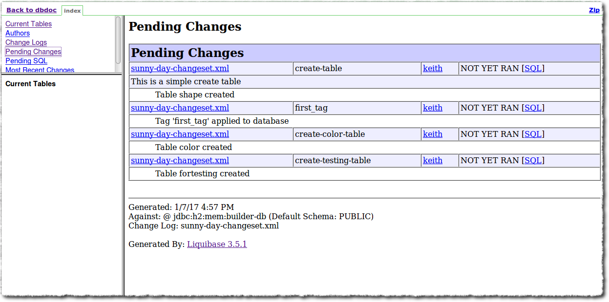
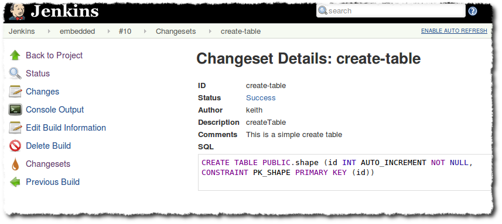
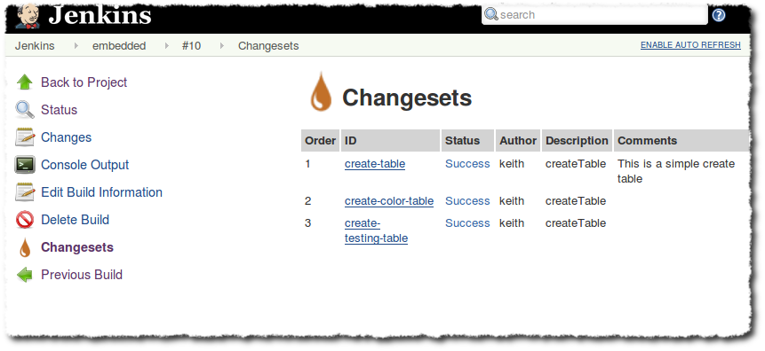
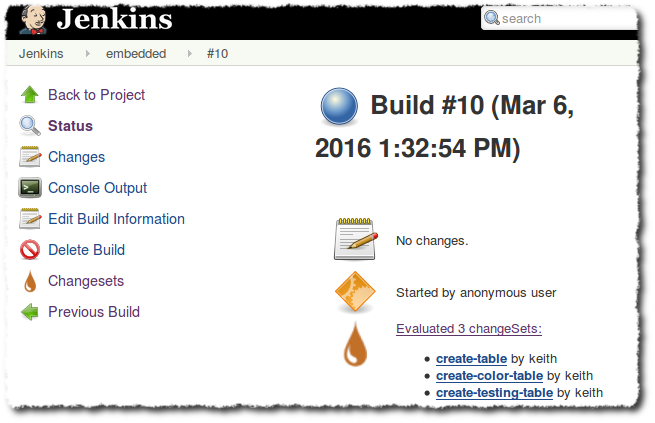

= Liquibase Runner

Provides https://www.liquibase.org/[Liquibase] build steps that evaluate liquibase changesets.

*Important Upgrade Information* +
Version 1.2.0 now uses the https://plugins.jenkins.io/credentials[Credentials Plugin] to manage usernames and passwords to connect to the database. If you were using username & password configuration in the previous version of this plugin, be aware that credentials will be automatically created upon plugin update.

[[LiquibaseRunner-Features]]
== Features

Adds liquibase related operations (update, rollback, and dbdoc generation) as available build steps. See Liquibase documentation at https://www.liquibase.org/[https://www.liquibase.org]. +
Evaluated changesets and their details appear on the build's summary page.

Uses liquibase version 3.8.9.

[frame=none,grid=none,.stripes-none,cols="50%,50%"]
|===
|
|
|
|

a| a| a| a
|===

[[LiquibaseRunner-KnownLimitations]]
== Known Limitations

* Jenkins controller will need to be able to connect to the target database. If, due to network constraints, your Jenkins agent node can initiate this connection but your Jenkins controller cannot, consider the workaround described in https://issues.jenkins-ci.org/browse/JENKINS-41002[JENKINS-41002], which uses port forwarding to facilitate database connectivity.

[[LiquibaseRunner-Installation]]
== Installation

* Install the liquibase-runner plugin using Jenkins' plugin manager. Depending on how you use and configure the plugin, you may need to install a database server, and potentially your target schema.
* Once installed, three build steps are made available: "Evaluate liquibase changesets", "Generate Liquibase dbDoc", and "Rollback liquibase changes".

[[LiquibaseRunner-CommonConfigurationAmongstBuilders]]
== Common Configuration Amongst Builders

[[LiquibaseRunner-Simplest]]
=== Simplest

By default, the plugin will use an instance of an https://www.h2database.com/[H2] in-memory database, so you need only define the location of your changeset file.   Note that changes won't be persisted across builds (though you may persist the H2 database to disk, see tips).

[[LiquibaseRunner-Advanced]]
=== Advanced

Those who would like more control over liquibase configuration may do so using options presented when using the "advanced" section of the builder configuration. Here you'll find most of liquibase's configuration exposed, including contexts and the JDBC URL used to access the database.

For convenience, the plugin includes a few database drivers for use. Alternatively, you may also define a classpath where a database driver may be loaded, and the driver classname.

Note that individual configuration values will override any found in a defined liquibase properties file.&nbsp; This emulates how command-line usage of liquibase works.

[[LiquibaseRunner-Evaluateliquibasechangesetsstep]]
== Evaluate liquibase changesets step

Creating a job with this build step will run liquibase's update on the target database.&nbsp; Alternatively, by checking "Test Rollbacks", liquibase's updateTestingRollbacks is executed.  Once a build has executed, details are provided about each changeset on the build summary.

[[LiquibaseRunner-Rollbackliquibasechangesstep]]
== Rollback liquibase changes step

The rollback build step invokes liquibase's "rollback" operation on the target database.&nbsp; There are a few rollback strategies to choose from that correspond to liquibase's rollback commands (by tag, by date, and by count).

This build step is intended for use when you're deploying to a real environment, and the need arises to undo a previous liquibase update.

[[LiquibaseRunner-DbDocGeneration]]
== DbDoc Generation

This build step generates Liquibase's dbDoc based on the supplied changelog. See https://docs.liquibase.com/commands/community/dbdoc.html[liquibase documentation].

It is recommended to use this in conjunction with the https://plugins.jenkins.io/htmlpublisher[HTMLPublisher plugin]

[[LiquibaseRunner-PipelineSupport]]
== Pipeline Support

All liquibase operations are available to pipeline scripts. See https://github.com/jenkinsci/liquibase-runner-plugin/blob/develop/src/docs/pipeline.md[documentation] for information and examples.

[[LiquibaseRunner-JobDSLIntegration]]
== Job DSL Integration

See https://github.com/jenkinsci/liquibase-runner-plugin/blob/develop/src/docs/jobdsl.md[documentation] regarding +
how to use the JobDSL plugin to generate liquibase projects.

[[LiquibaseRunner-UsageTips]]
== Usage Tips

* If you'd like to have only new changesets evaluated, consider using an H2 JDBC url like +
"jdbc:h2:file:./data/sample". This instructs H2 to persist the database to a file. Note, however, if a different +
build agent runs your project, that file will no longer be available, and all changesets will again be executed.

[[Plugin_changelog]]
== Plugin changelog

* link:/CHANGELOG.md[CHANGELOG]

[[License]]
== License
* https://opensource.org/licenses/mit-license.php[MIT License]
